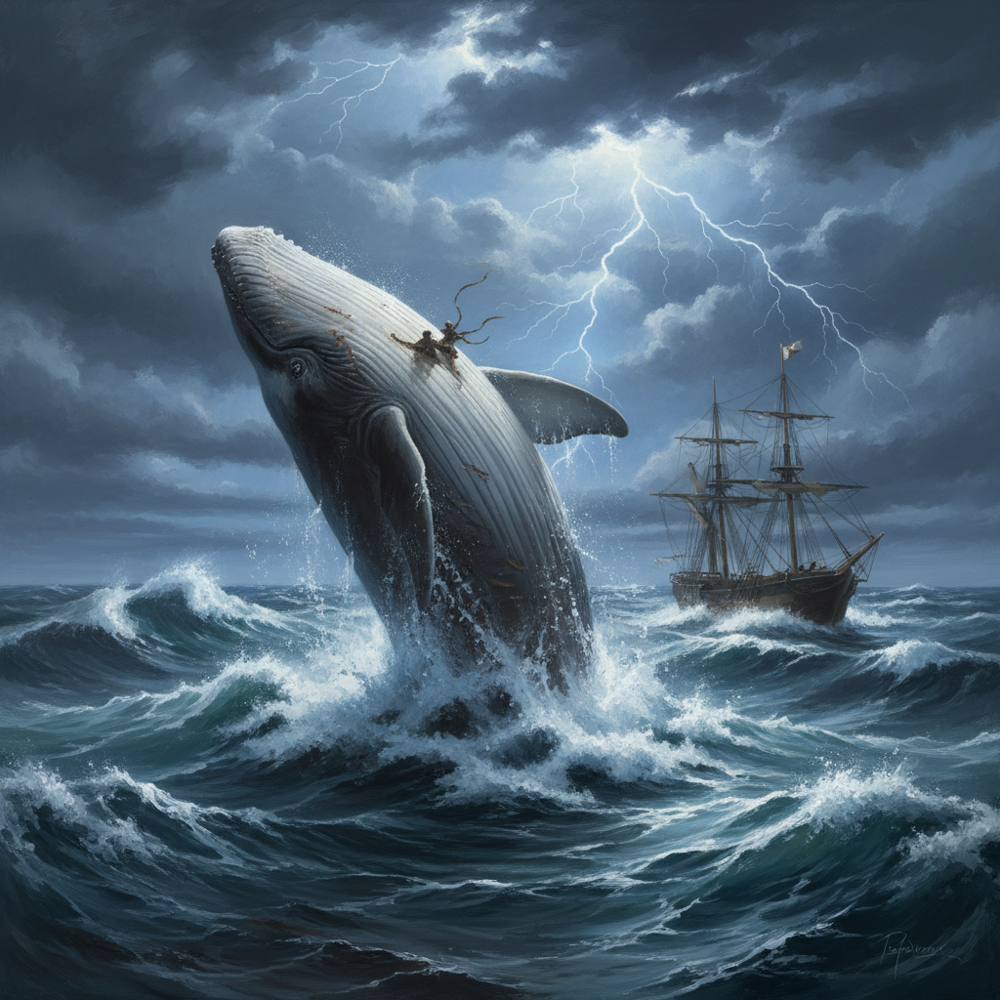

[//]: # (A digital archive of Herman Melville's Moby Dick, sourced from Project Gutenberg, featuring the complete public domain text and AI-generated illustration of the legendary white whale.)

# 🐋 Moby Dick — A Digital Archive

### *The Complete Text of Herman Melville's Masterpiece*

---

> *"It is not down on any map; true places never are."*
>
> — **Herman Melville**, *Moby Dick*

---

*AI-generated illustration of the White Whale*

---

## 📖 About This Repository

**moby-dick-gutenberg** is a curated digital archive preserving Herman Melville's *Moby Dick; or, The Whale* in plain text format, sourced directly from [Project Gutenberg](https://www.gutenberg.org/). This repository pairs the complete, unabridged novel with an original AI-generated illustration, making it a convenient resource for researchers, developers, literary enthusiasts, and anyone building text-based projects or NLP datasets.

### Repository Contents

| File | Description |
|------|-------------|
| [`moby-dick.txt`](moby-dick.txt) | The complete, unabridged text of *Moby Dick* |
| [`moby-dick-illustration.png`](moby-dick-illustration.png) | AI-generated artwork depicting the white whale |
| `README.md` | This file |

---

## 🐳 About the Book

**Title:** Moby Dick; or, The Whale
**Author:** Herman Melville (1819–1891)
**First Published:** October 18, 1851
**Genre:** Adventure Fiction · Literary Fiction · Nautical Fiction
**Language:** English

### Synopsis

*Moby Dick* tells the story of **Ishmael**, a young sailor who joins the crew of the whaling ship *Pequod*, commanded by the enigmatic and obsessive **Captain Ahab**. Ahab is consumed by a singular, monomaniacal quest: to hunt down and destroy **Moby Dick**, the enormous white sperm whale that severed his leg on a previous voyage.

What unfolds is far more than a tale of maritime adventure. Melville weaves together a profound meditation on obsession, fate, free will, the nature of evil, and humanity's relationship with the natural world. The novel draws upon encyclopedic knowledge of whaling, cetology, and seafaring life, blending narrative fiction with philosophical inquiry, scientific exposition, and Shakespearean drama.

Though it received mixed reviews and poor sales upon publication — and was largely forgotten by the time of Melville's death in 1891 — *Moby Dick* was rediscovered in the early 20th century and is now universally regarded as one of the **greatest works of American literature** and a cornerstone of the Western literary canon.

### About the Author

**Herman Melville** (August 1, 1819 – September 28, 1891) was an American novelist, short story writer, and poet. His early novels based on his experiences at sea — *Typee* (1846) and *Omoo* (1847) — brought him early fame, but his more ambitious later works, including *Moby Dick* and *Bartleby, the Scrivener*, were not fully appreciated during his lifetime. Today, he is celebrated as one of America's most important and innovative literary voices.

---

## 🎨 About the Artwork

The illustration included in this repository (`moby-dick-illustration.png`) is an **AI-generated** artistic interpretation of the legendary white whale. It was created to serve as a visual companion to the archived text.

- **Medium:** AI-generated digital artwork
- **Subject:** Moby Dick, the great white sperm whale, breaching from a turbulent ocean
- **Purpose:** Visual accompaniment and repository imagery

> **Note:** This image was generated by artificial intelligence and is not a reproduction of any historical illustration. It is provided as-is for decorative and educational purposes.

---

## 📚 Data Source

The text of *Moby Dick* in this repository is sourced from **Project Gutenberg**, the oldest digital library of free eBooks.

| Detail | Information |
|--------|-------------|
| **Source** | [Project Gutenberg](https://www.gutenberg.org/) |
| **Catalog Entry** | [EBook #2701](https://www.gutenberg.org/ebooks/2701) |
| **Format** | Plain text (UTF-8) |
| **Release Date** | June 2001 (Project Gutenberg) |
| **Last Updated** | See [PG catalog page](https://www.gutenberg.org/ebooks/2701) for latest revision |

Project Gutenberg is a volunteer effort to digitize and archive cultural works. Founded by **Michael S. Hart** in 1971, it offers over 70,000 free eBooks, with a focus on works whose U.S. copyright has expired.

---

## ⚖️ License & Legal

### Text — Public Domain

The text of *Moby Dick* by Herman Melville is in the **public domain** in the United States and in most countries worldwide. The novel was first published in 1851, and its copyright has long since expired.

The Project Gutenberg version is free to use for any purpose — personal, educational, or commercial — with no restrictions. While Project Gutenberg requests adherence to their [trademark license](https://www.gutenberg.org/policy/license.html) when using their name, the underlying text itself carries no copyright.

### Illustration — AI-Generated

The AI-generated illustration (`moby-dick-illustration.png`) is provided freely for use. AI-generated images currently occupy an evolving legal landscape regarding copyright. This image is offered without restriction to the fullest extent possible. Use it as you see fit.

---

## 💡 Potential Uses

This repository can serve as a resource for:

- 🔬 **Natural Language Processing (NLP)** — tokenization, sentiment analysis, topic modeling
- 📊 **Text analysis & data science** — word frequency, readability metrics, stylometry
- 🎓 **Education** — literary study, digital humanities coursework
- 💻 **Software development** — testing text processing pipelines, search engines, or rendering engines
- 📝 **Creative projects** — adaptations, visualizations, interactive fiction

---

## 🌟 A Parting Word

> *"I know not all that may be coming, but be it what it will, I'll go to it laughing."*
>
> — **Herman Melville**, *Moby Dick* (1851)

---

**⭐ Star this repository if you love classic literature, open data, or great white whales.**

